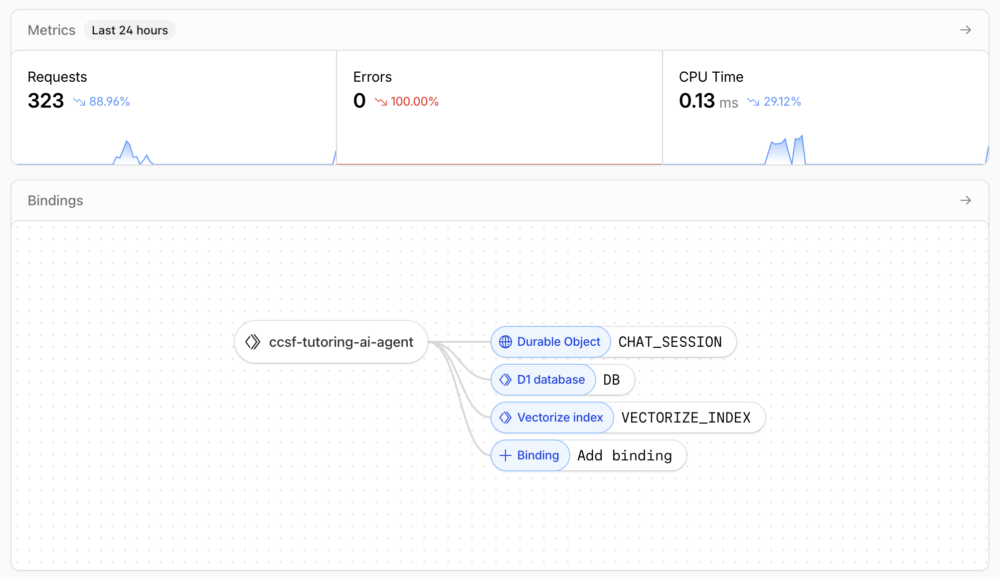

# CF AI: CCSF Tutoring AI Agent

An AI-powered tutoring scheduling system built on Cloudflare that matches students with tutors using conversational AI and automates the entire booking workflow.

## 🎯 Project Overview

This application demonstrates a complete AI-powered system using Cloudflare's platform, featuring:
- **LLM Integration**: OpenAI GPT-4o-mini for intelligent tutor matching and conversational responses
- **Workflow/Coordination**: Cloudflare Durable Objects for persistent chat state and session management
- **User Input**: Real-time chat interface built with Next.js Pages
- **Memory/State**: Durable Objects store conversation history, pending matches, and booking information

## ✨ Key Features

- 🤖 **AI-Powered Tutor Matching**: Uses RAG (Retrieval-Augmented Generation) with semantic search to match students with tutors
- 💬 **Conversational Interface**: Natural language chat interface with streaming responses
- 📅 **Automated Booking**: End-to-end automation of Calendly booking forms using Puppeteer
- 🔄 **Persistent State**: Chat sessions persist across page refreshes using Cloudflare Durable Objects
- 🚀 **Serverless Architecture**: Built on Cloudflare Workers for global scalability
- 📊 **Vector Search**: Cloudflare Vectorize for semantic tutor search using embeddings

## 🏗️ Architecture

```
┌─────────────────┐
│   Next.js UI    │  (User Interface)
│  (Pages/React)  │
└────────┬────────┘
         │
         ▼
┌─────────────────┐
│  Cloudflare     │  (API Routes)
│    Workers      │
└────────┬────────┘
         │
    ┌────┴────┬──────────────┬──────────────┬──────────────┐
    ▼         ▼              ▼              ▼              ▼
┌────────┐ ┌──────────┐ ┌──────────┐ ┌──────────┐ ┌──────────┐
│   D1   │ │Vectorize │ │ Durable  │ │LangChain │ │  OpenAI  │
│  (SQL) │ │(Vectors) │ │ Objects  │ │  (AI     │ │   API    │
│        │ │          │ │          │ │Framework)│ │          │
└────────┘ └──────────┘ └──────────┘ └──────────┘ └──────────┘
```

## 🥂 Demo


Check out the full demo here: [Cloudflare AI Agent Demo](https://drive.google.com/file/d/1FXhvowtOPAoTbdWXttp_MIjzTZFe-dWo/view)


## 🛠️ Tech Stack

### Frontend
- **Next.js 16** - React framework with App Router
- **TypeScript** - Type-safe development
- **Tailwind CSS** - Styling
- **Framer Motion** - Animations
- **Server-Sent Events (SSE)** - Real-time streaming

### Backend & AI
- **Cloudflare Workers** - Serverless API endpoints
- **OpenAI GPT-4o-mini** - LLM for chat and matching
- **LangChain** - AI framework for streaming, structured outputs, and tools
- **RAG Pipeline** - Semantic search using embeddings

### Cloudflare Services
- **D1** - SQLite-compatible database for tutor data
- **Vectorize** - Vector database for semantic search
- **Durable Objects** - Persistent state for chat sessions
- **Workers** - Serverless compute

### Automation
- **Puppeteer** - Browser automation for Calendly form filling

### Tools
- **Zod** - Schema validation
- **Wrangler CLI** - Cloudflare deployment tool

## 📋 Prerequisites

- Node.js 18+ and npm
- Cloudflare account (free tier works)
- OpenAI API key
- Git

## 🚀 Quick Start

### 1. Clone the Repository

```bash
git clone https://github.com/NikkiAung/cf_ai_ccsf_tutoring_ai_agent.git
cd cf_ai_ccsf_tutoring_ai_agent
```

### 2. Install Dependencies

```bash
npm install
```

### 3. Set Up Environment Variables

Create a `.env.local` file:

```env
# OpenAI API Key
OPENAI_API_KEY=your_openai_api_key_here

# Cloudflare API Token (for D1 HTTP API access)
CLOUDFLARE_API_TOKEN=your_cloudflare_api_token_here
CLOUDFLARE_ACCOUNT_ID=your_account_id_here
CLOUDFLARE_D1_DATABASE_ID=your_account_db_id_here
NEXT_PUBLIC_WORKER_URL=your_next_public_worker_url_here (http://localhost:8787)

# Worker URL (for Durable Objects - set after deployment)
WORKER_URL=https://your-worker.workers.dev
```

### 4. Set Up Cloudflare Services

#### Create D1 Database

```bash
wrangler d1 create ccsf-tutoring-db
```

Update `wrangler.toml` with your database ID.

#### Run Migrations

```bash
wrangler d1 execute ccsf-tutoring-db --file=./migrations/0001_initial_schema.sql
wrangler d1 execute ccsf-tutoring-db --file=./migrations/0002_seed_data.sql
```

#### Create Vectorize Index

```bash
wrangler vectorize create ccsf-tutors-index --dimensions=1536 --metric=cosine
```

#### Generate and Upload Embeddings

```bash
# Generate embeddings locally
npm run seed:embeddings

# Upload to Cloudflare Vectorize
npm run seed:embeddings:cloudflare
```

### 5. Deploy Cloudflare Worker (for Durable Objects)

```bash
wrangler deploy
```

After deployment, update `.env.local` with your Worker URL:
```env
WORKER_URL=https://ccsf-tutoring-ai-agent.your-subdomain.workers.dev
```

### 6. Run Development Server

```bash
npm run dev
```

Visit `http://localhost:3000/schedule` to start using the application.

## 📖 Usage Guide

### For Students

1. **Start a Conversation**: Visit the schedule page and start chatting
2. **Request Help**: Type what you need help with (e.g., "I need help with Python")
3. **Review Match**: The AI will suggest a tutor based on your needs
4. **See Other Options**: Ask "show me other tutors" to see alternatives
5. **Book Session**: Confirm booking and provide required information through the multi-step form
6. **Automatic Booking**: The system automatically fills out the Calendly form

### Example Conversation Flow

```
Student: "I need help with JavaScript"
AI: "I found a great match! Chris H is available..."
Student: "Show me other tutors"
AI: "Here are other JavaScript tutors: [list]"
Student: "Yes, I want to book with Chris"
AI: "Step 1/7: Please provide your name and email..."
[Continues through booking steps]
AI: "✅ Booking Complete! Your form has been automatically filled."
```

## 🧪 Testing

### Test the Chat Interface

1. Start the dev server: `npm run dev`
2. Navigate to `/schedule`
3. Try these prompts:
   - "I need help with Python"
   - "Show me other tutors"
   - "I want to book a session"

### Test API Endpoints

```bash
# Get all tutors
curl http://localhost:3000/api/tutors

# Match a tutor
curl -X POST http://localhost:3000/api/match \
  -H "Content-Type: application/json" \
  -d '{"skill": "Python", "day": "Monday"}'

# Stream chat response
curl -X POST http://localhost:3000/api/chat/stream \
  -H "Content-Type: application/json" \
  -d '{"message": "Hello", "chatHistory": []}'
```

## 📁 Project Structure

```
├── app/                    # Next.js app directory
│   ├── api/               # API routes
│   │   ├── book/          # Booking endpoints
│   │   ├── chat/          # Chat endpoints
│   │   ├── match/         # Tutor matching
│   │   └── tutors/        # Tutor data
│   └── schedule/          # Main scheduling page
├── components/            # React components
│   └── schedule/          # Chat interface
├── lib/                   # Core libraries
│   ├── ai.ts             # AI matching logic
│   ├── langchain-*.ts    # LangChain integrations
│   ├── vectorize.ts      # Vector search
│   └── calendly-*.ts     # Calendly automation
├── durable-objects/       # Durable Object classes
│   └── chat-session.ts   # Chat state management
├── migrations/            # D1 database migrations
└── types/                 # TypeScript types
```

## 🔧 Configuration

### Environment Variables

| Variable | Description | Required |
|----------|-------------|----------|
| `OPENAI_API_KEY` | OpenAI API key for LLM | Yes |
| `CLOUDFLARE_API_TOKEN` | Cloudflare API token | Yes (for D1) |
| `CLOUDFLARE_ACCOUNT_ID` | Cloudflare account ID | Yes (for D1) |
| `WORKER_URL` | Deployed Worker URL | Yes (for Durable Objects) |

### Cloudflare Configuration

See `wrangler.toml` for:
- D1 database bindings
- Vectorize index bindings
- Durable Object bindings
- Worker configuration

## 🚢 Deployment

### Deploy to Cloudflare

```bash
# Deploy Worker
wrangler deploy

# Deploy Next.js (if using Cloudflare Pages)
npm run build
# Then deploy via Cloudflare Pages dashboard
```

### Production Checklist

- [ ] Set environment variables in Cloudflare dashboard
- [ ] Deploy Worker with Durable Objects
- [ ] Verify D1 database is accessible
- [ ] Verify Vectorize index has embeddings
- [ ] Test end-to-end booking flow
- [ ] Set up monitoring and error tracking

## 📚 Documentation

- [AI Architecture](./AI_ARCHITECTURE.md) - AI system design
- [RAG Implementation](./RAG_IMPLEMENTATION.md) - RAG pipeline details
- [LangChain Integration](./LANGCHAIN_INTEGRATION.md) - LangChain features
- [Durable Objects Setup](./DUrable_Objects_Setup_Guide.md) - State management
- [Calendly Automation](./CALENDLY_AUTOMATION.md) - Booking automation

## 🤝 Contributing

This is an assignment project. For questions or issues, please refer to the documentation or create an issue.

## 📝 License

This project is created for educational/assignment purposes.

## 🙏 Acknowledgments

- Cloudflare for the amazing platform and services
- OpenAI for GPT models
- LangChain for the AI framework
- Next.js team for the excellent framework

---

**Built with ❤️ using Cloudflare Workers, D1, Vectorize, and Durable Objects**
